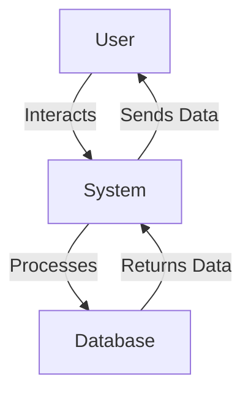
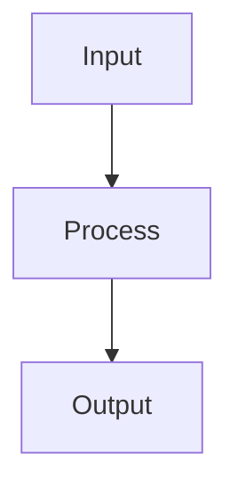
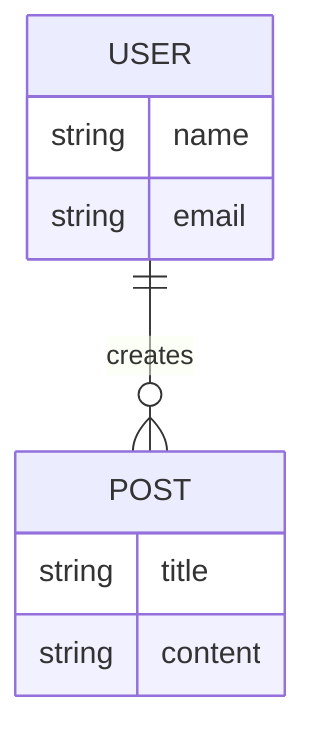

# Architecture Overview

## Level 0 Data Flow Diagram (DFD)

```mermaid
graph TD
    A[User] -->|Interacts| B[System]
    B -->|Processes| C[Database]
    C -->|Returns Data| B
    B -->|Sends Data| A
```

## Level 1 Data Flow Diagrams (DFD)
### Module 1

```mermaid
graph TD
    A[Input] --> B[Process]
    B --> C[Output]
```

### Module 2

```mermaid
graph TD
    D[Input] --> E[Process]
    E --> F[Output]
```

## Entity-Relationship Diagram (ERD)

```mermaid
erDiagram
    USER {
        string name
        string email
    }
    POST {
        string title
        string content
    }
    USER ||--o{ POST : creates
```
