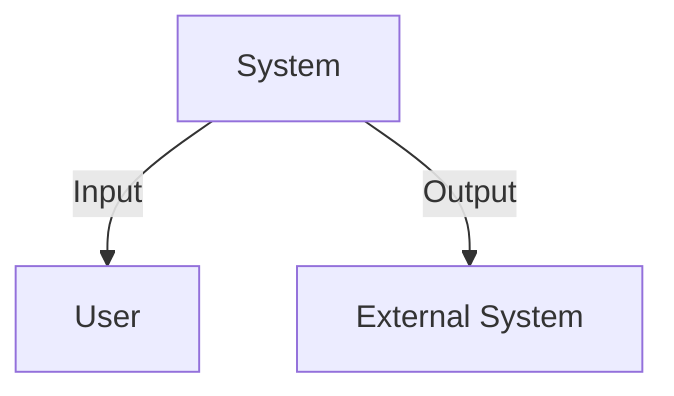
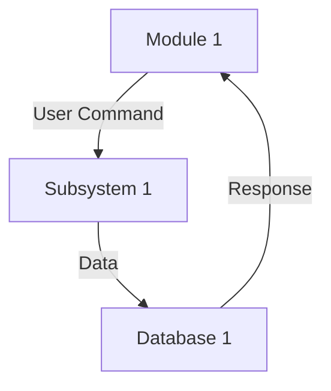
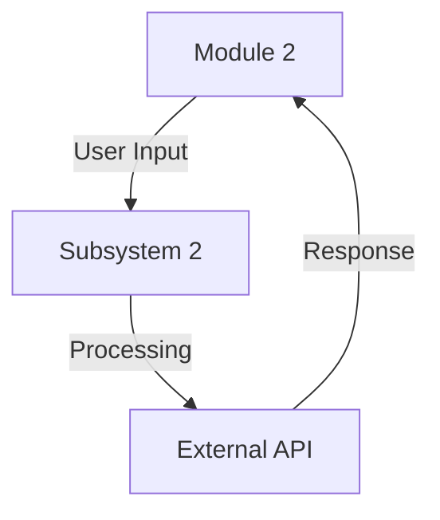
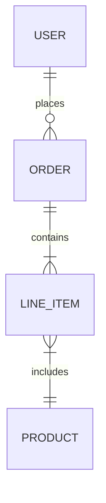

# Architecture Documentation

## Level 0 DFD

## Level 1 DFDs for All Modules

### Module 1 DFD

### Module 2 DFD

## ER Diagram

---

*This document provides an overview of the architecture of the system, showcasing the major components and their interactions.*