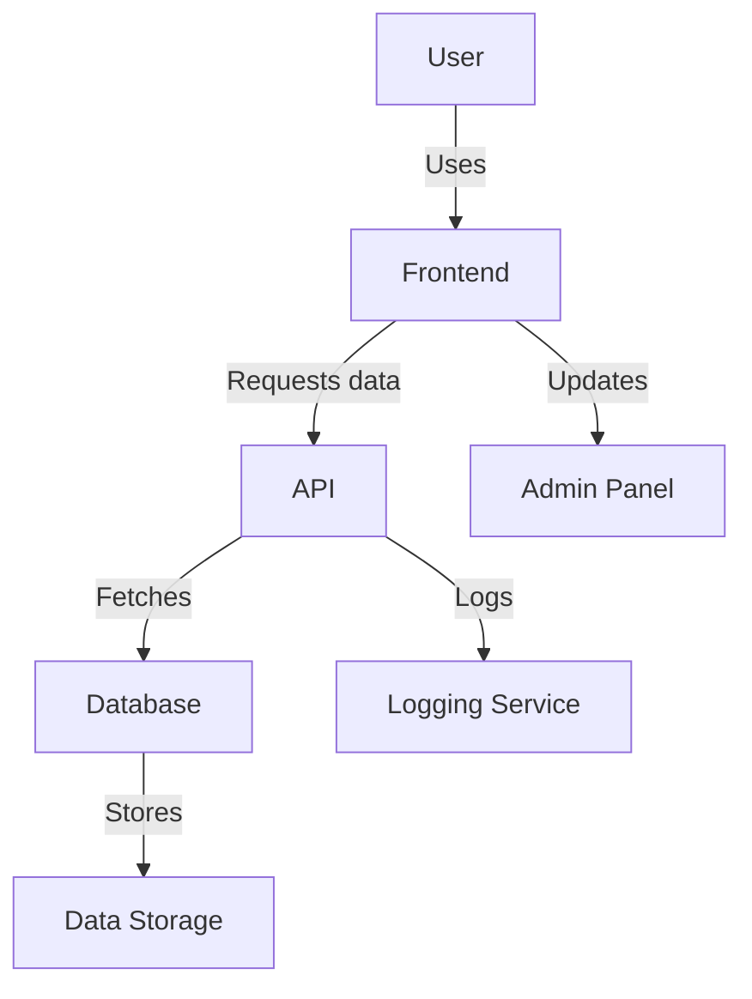

```mermaid
  graph TD;
      A[User] -->|Uses| B[Frontend];
      B -->|Requests data| C[API];
      C -->|Fetches| D[Database];
      D -->|Stores| E[Data Storage];
      B -->|Updates| F[Admin Panel];
      C -->|Logs| G[Logging Service];
```